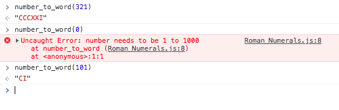

## Roman_Numberals
Write an app that can convert decimal numbers from 1 to 1000 into Roman Numerals e.g. 1 becomes "I", 66 becomes "LXVI"

## Launch and Test
Run the test
```
$ git clone https://github.com/jeff1108/Roman_Numerals.js.git
$ open SpecRunner.html
```
Open console and type any number between 1 to 1000:
```
number_to_word(1)
=> I
number_to_word(329)
=> CCCXXI  
```
Raise error if number is lower than 1 or larger than 1000
```
number_to_word(0)
=> number needs to be 1 to 1000
```


## Example

